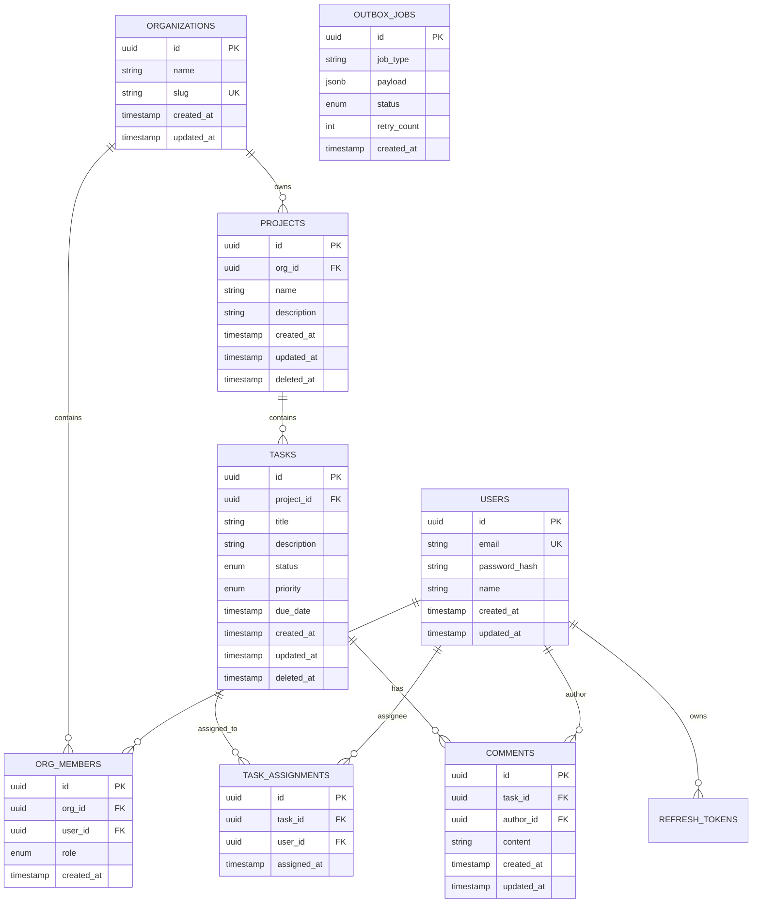

# TaskFlow — System Architecture & Technical Design Document

TaskFlow is a production-grade, multi-tenant project management backend designed for scalability, strong tenant isolation, clean separation of concerns, and reliable asynchronous processing.

---

## 1. High-Level Architecture Overview

TaskFlow follows a **Layered Architecture** adhering to clean code and domain-driven design principles:

```
[ Client / Postman / Swagger UI ]
               │ (HTTP / JSON)
               ▼
[ Global Security Middlewares ] ───► Helmet (Security Headers)
                                 ───► CORS Policy
                                 ───► Rate Limiter (10 req/min/IP on Auth)
                                 ───► Morgan Request Logger
               │
               ▼
[ Auth & Tenant Isolation Middleware ] ───► JWT Access Token (15m TTL) Verification
                                        ───► Database Membership Validation
                                        ───► Attaches req.user & req.authOrg
                                        ───► Blocks Cross-Tenant Ingress (403 Forbidden)
               │
               ▼
┌─────────────────────────────────────────────────────────────┐
│                       Express API Layer                     │
│                                                             │
│  [ Routes ] ──► [ Zod Validation ] ──► [ Controllers ]      │
│                                              │              │
│                                              ▼              │
│                                    [ Domain Services ]      │
│                                      │              │       │
│                ┌─────────────────────┘              └─────┐ │
│                ▼                                          ▼ │
│     [ Repositories / Prisma ]                  [ BullMQ Enqueue ]
└────────────────┼──────────────────────────────────────────┼─┘
                 │                                          │
                 ▼                                          ▼
   [( PostgreSQL 16 DB )]                          [( Redis 7 Queue )]
   - Multi-Tenant Schema                           - Job Deduplication (5s)
   - Transactional Outbox                          - Rate Limiter (50/min)
   - Full-Text Search (GIN)                                 │
   - Soft Delete (deleted_at)                               │
                                                            ▼
                                                [ Background Worker ]
                                                - Mock Email Transporter
                                                - Exponential Backoff (1s->2s->4s)
                                                - Dead-Letter Queue (DLQ)
```

---

## 2. Multi-Tenancy Isolation Model

### 2.1 Isolation Strategy
TaskFlow utilizes a **Logical Multi-Tenancy** architecture with strict organization-level row scoping in PostgreSQL:
- Every `Project`, `Task`, `TaskAssignment`, and `Comment` resides within an `Organization`.
- The user's active tenant context is resolved through their validated `OrgMember` association.
- **Client-provided `org_id` values are NEVER trusted**:
  - The active organization is derived directly from the authenticated JWT token or validated against the user's active memberships if `x-organization-id` header is passed.
  - If a user attempts to access an organization they do not belong to, the request is immediately rejected with `403 Forbidden` (`CROSS_TENANT_ACCESS_FORBIDDEN`).

### 2.2 Cross-Tenant Protection Guarantee
When accessing individual resources (`/projects/:id`, `/tasks/:id`, `/tasks/:id/assign`):
1. The database checks that the target resource exists.
2. The resource's owning `orgId` is compared against `req.authOrg.orgId`.
3. If there is a mismatch, a standardized `403 Forbidden` response is returned immediately:
   ```json
   {
     "error": "Cross-tenant access forbidden: Resource belongs to a different organization",
     "code": "CROSS_TENANT_ACCESS_FORBIDDEN",
     "details": {}
   }
   ```
4. **Information Leakage Prevention**: No sensitive fields or data about cross-tenant resources are returned in the response body.

---

## 3. Database Schema & Data Modeling

### 3.1 Entity Relationship Diagram (ERD)



### 3.2 Foreign Key Decisions (CASCADE vs. RESTRICT)

| Foreign Key | Parent Table | Child Table | Delete Rule | Rationale |
| :--- | :--- | :--- | :--- | :--- |
| `org_id` | `organizations` | `org_members` | `CASCADE` | When an organization is deleted, its memberships must be removed cleanly. |
| `user_id` | `users` | `org_members` | `CASCADE` | Deleting a user account cleanly removes their memberships. |
| `user_id` | `users` | `refresh_tokens` | `CASCADE` | Deleting a user account immediately wipes all active refresh tokens and sessions. |
| `org_id` | `organizations` | `projects` | `CASCADE` | Removing an organization removes all projects belonging to it. |
| `project_id` | `projects` | `tasks` | `CASCADE` | Tasks belong to a specific project. Deleting the project cascades to its tasks. |
| `task_id` | `tasks` | `task_assignments` | `CASCADE` | Deleting a task cleans up its assignment mappings. |
| `user_id` | `users` | `task_assignments` | `CASCADE` | Removing a user account unassigns them from all tasks. |
| `task_id` | `tasks` | `comments` | `CASCADE` | Comments are scoped to a task; deleting the task cascades comments. |
| `author_id` | `users` | `comments` | `CASCADE` | Deleting a user account cleans up user-generated comments. |

---

## 4. Indexing Strategy & Justifications

To achieve high-performance query execution and support high concurrent loads, specific indexes were designed:

1. **`users(email)` (Unique Index)**: Fast $O(1)$ login lookups and uniqueness enforcement.
2. **`organizations(slug)` (Unique Index)**: Fast tenant subdomain/slug resolution.
3. **`org_members(user_id, org_id)` & `(org_id, role)`**: Accelerates multi-tenant permission queries and RBAC checks on every authenticated API request.
4. **`projects(org_id, deleted_at)`**: Scoped composite index enabling instant project listing while transparently filtering soft-deleted records.
5. **`tasks(project_id, deleted_at)`**: Fast retrieval of active project tasks without table scans.
6. **`tasks(project_id, status)` & `tasks(project_id, priority)` & `tasks(project_id, due_date)`**: B-tree indexes supporting efficient multi-attribute filtering and sorting.
7. **PostgreSQL Full-Text Search GIN Index (`idx_tasks_search_gin`)**:
   ```sql
   CREATE INDEX "idx_tasks_search_gin" ON "tasks" 
   USING GIN (to_tsvector('english', coalesce("title", '') || ' ' || coalesce("description", '')));
   ```
   **Justification**: A Generalized Inverted Index (GIN) enables sub-millisecond full-text document searches across task titles and descriptions using PostgreSQL stemming and lexeme normalization, outperforming generic wildcard `LIKE %term%` queries.
8. **`task_assignments(task_id, user_id)` (Unique Index)**: Enforces unique assignment pairs and speeds up assignee join queries.
9. **`refresh_tokens(token_hash)` (Unique Index)** & `(user_id, revoked_at)`: Instant $O(1)$ session lookups and device revocation tracking.
10. **`outbox_jobs(status, created_at)`**: High-speed polling index for pending transactional outbox events.

---

## 5. Role-Based Access Control (RBAC) Matrix

| Resource / Action | `org_admin` | `member` |
| :--- | :---: | :---: |
| Register / Login / Logout | ✅ | ✅ |
| View Organization Profile (`/auth/me`) | ✅ | ✅ |
| View Projects (`GET /projects`) | ✅ | ✅ |
| Create Project (`POST /projects`) | ✅ | ✅ |
| Update Project (`PATCH /projects/:id`) | ✅ | ✅ |
| Delete Project (`DELETE /projects/:id`) | ✅ | ❌ (*403 Forbidden*) |
| View Project Dashboard (`GET /projects/:id/dashboard`) | ✅ | ✅ |
| List / Search Tasks (`GET /tasks`) | ✅ | ✅ |
| Create Task (`POST /tasks`) | ✅ | ✅ |
| Update Task (`PATCH /tasks/:id`) | ✅ | ✅ |
| Delete Task (`DELETE /tasks/:id`) | ✅ | ✅ |
| Bulk Update Task Status (`PATCH /tasks/bulk-status`) | ✅ | ✅ |
| Assign Task (`POST /tasks/:id/assign`) | ✅ | ✅ (Same-Org only) |
| Unassign Task (`POST /tasks/:id/unassign`) | ✅ | ✅ |
| Add / View Comments (`/tasks/:id/comments`) | ✅ | ✅ |
| Check Background Job Status (`GET /jobs/:id`) | ✅ | ✅ |

---

## 6. Background Jobs, Queue & Consistency Architecture

### 6.1 Transactional Outbox Consistency Strategy
When an assignment is created:
1. **Database Transaction**:
   - The `TaskAssignment` record is persisted in PostgreSQL.
   - An `OutboxJob` record with status `pending` is created in the same atomic transaction.
   - If the database commit fails, no job is dispatched, preventing phantom notifications.
2. **Immediate Asynchronous Dispatch**:
   - The API triggers `enqueueAssignmentNotification` to push the payload to BullMQ.
   - If Redis is reachable, the job is enqueued immediately and the API returns a success response with `{ assignment, job: { id, enqueued: true } }`.
   - If Redis is temporarily down, the API does **not** fail the assignment; the `OutboxJob` remains in PostgreSQL and is reconciled by the outbox processor once Redis recovers.

### 6.2 Retry Policy with Exponential Backoff
- **Attempts**: 3
- **Backoff Configuration**:
  ```ts
  backoff: {
    type: 'exponential',
    delay: 1000 // 1st retry: 1s, 2nd retry: 2s, 3rd retry: 4s
  }
  ```

### 6.3 Dead-Letter Queue (DLQ)
- If all 3 retry attempts fail (e.g. permanent SMTP outage), the BullMQ worker event listener intercepts the exhaustion event.
- The job is moved to `email-notifications-dlq`.
- The database `outbox_jobs` entry is marked `status = 'failed'` with the captured stack trace.
- The job status in `GET /jobs/:id` reports `status: "failed"`.

### 6.4 Deduplication & Rate Limiting
- **Assignment Deduplication**: 5-second debounce window achieved via custom job ID keying:
  ```ts
  const fiveSecondWindow = Math.floor(Date.now() / 5000);
  const jobId = `assignment_${taskId}_${userId}_${fiveSecondWindow}`;
  ```
  Duplicate assignments within 5 seconds share the same job ID and are safely debounced by Redis.
- **Global Rate Limiter**: BullMQ worker concurrency and rate limiter configured to `50 emails / minute` (`max: 50, duration: 60000`).

---

## 7. Standardized Error Response Format

All API errors return a uniform schema with HTTP status codes:

```json
{
  "error": "Human readable error message",
  "code": "ERROR_CODE_STRING",
  "details": {}
}
```

### Common Error Codes
- `VALIDATION_ERROR` (400): Zod validation failure.
- `UNAUTHORIZED` / `TOKEN_EXPIRED` (401): Missing or expired JWT.
- `CROSS_TENANT_ACCESS_FORBIDDEN` (403): Attempt to access a resource in another organization.
- `CROSS_TENANT_ASSIGNMENT_FORBIDDEN` (403): Attempt to assign a user from a different organization.
- `INSUFFICIENT_PERMISSIONS` (403): Member trying to execute an admin-only action (e.g. delete project).
- `TASK_NOT_FOUND` / `PROJECT_NOT_FOUND` (404): Resource not found.
- `USER_EMAIL_EXISTS` (409): Unique constraint violation.
- `RATE_LIMIT_EXCEEDED` (429): Exceeded 10 requests / minute on auth endpoints.
